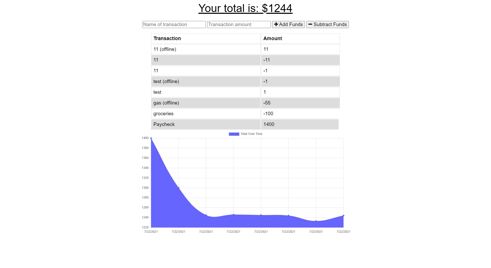

# Unit 19 PWA Homework: Online/Offline Budget Trackers

## Summary

Added functionality to an existing Budget Tracker application that allows for offline access and functionality.

The user is able to add expenses and deposits to the budget with or without a connection. When entering transactions offline, populating the total when brought back online.

As an avid traveller I want to be able to track my withdrawals and deposits with or without a data/internet connection so that my account balance is accurate when I am traveling.

# Table of Contents

- [Summary](#summary)
- [Installation](#installation)
- [Deployed Link](#deployed-link)
- [Screen Shots](#screen-shots)
- [Credit](#credit)

# Installation

Packages include: 

- Express

- Mongoose

- Morgan

# Deployed Link

## [Offline Budget](https://greve-baguette-43046.herokuapp.com/)

- https://greve-baguette-43046.herokuapp.com/

# Screen Shot

 

# Credit
This was made with ❤️ by Eric Dodgion 07/01/21